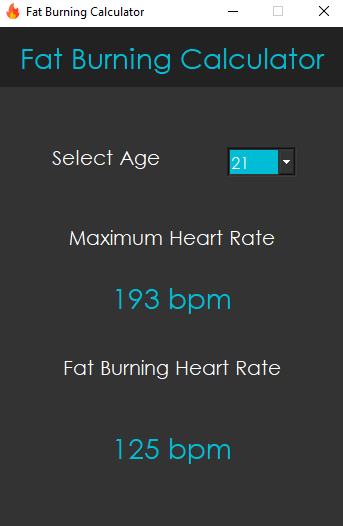

# Desktop GUI Application using Python and PyQt5

Project is created using Python, Qt Designer and PyQt5. 
I hope it helps everyone who is starting out in the Python world by building a simple GUI application. 
This project works very well with Windows OS. It is NOT tested on linux and mac OS.

## Calculation of bpm

- The application takes age as input and calculates maximum heart rate and fat burning heart rate.
- Maximum heart rate is calculated using (206.9 - (0.67 * age))
- Target fat burning heart rate is calculated using (0.65 * maximum heart rate)
- Formulae are taken from **Med Sci Sports Exerc.** as mentioned in **"Data Structures and Algorithms in Python"** by 
*Michael T. Goodrich*, *Roberto Tamassia* and *Michael H. Goldwasser*

##Download and Installation
Please [watch the video](https://www.youtube.com/watch?v=sNI49tKbIMA) to download and install the application on windows OS.

## Credits

Icons made by 
<a href="https://www.flaticon.com/authors/freepik" title="Freepik">Freepik</a> 
from <a href="https://www.flaticon.com/" title="Flaticon">www.flaticon.com</a>

## Note
The application is created just to demonstrate building apps with python and not to be taken seriously.

